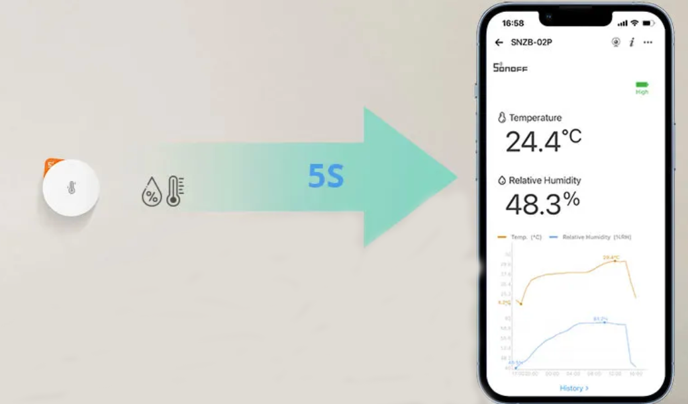

# Homebridge Influxdb2 Air 


Homebridge InfluxDB2 Air is a plugin that exposes temperature, humidity, battery level from sensors stored in an InfluxDB v2 database.It collects the latest values using the topic and field as filters in the InfluxDB query, making this data available for integration with Homebridge. This allows for seamless monitoring and control of your sensor data within your smart home ecosystem.

Initially,it was developed to expose SONOFF [SNZB-02P](https://sonoff.tech/product/gateway-and-sensors/snzb-02p/ "SONOFF") sensors, making this data available for integration with Homebridge



---

## Install

Install the plugin using:

```bash
npm i -g homebridge-influxdb2-air
```

## Configure

Add to the `accessories` field of your Homebridge `config.json` file (default location at `~/.homebridge/config.json`) :

```json
{
  ...
  "platforms": [
    {
      "platform": "InfluxDBMultiSensor",
      "name": "InfluxDB Sensor",
      "url": "http://your-influxdb-url",
      "token": "your-influxdb-token",
      "organization": "your-influxdb-organization",
      "bucket": "your-influxdb-bucket",,
      "globalValues": {
        "manufacturer": "Your Manufacturer",
        "serialNumber": "1234567890",
        "model": "Sensor"
      },
      "sensors": [
        {
          "name": "Temperature Room1",
          "fields": [
              "temperature",
              "humidity",
              "battery"
          ],
          "topic": "zigbee2mqtt/Sensor_Room1"
      }
       # Add more sensors here 
      ]
    }
  ]
 } 
```
Learn more at [config_sample.json](./config_sample.json).

## Influx request

```
from(bucket: "${this.platform.config.bucket}")
        |> range(start: -1m)
        |> filter(fn: (r) => r["topic"] == "${this.sensorConfig.topic}")
        |> filter(fn: (r) => r["_field"] == "${this.sensorConfig.field}")
        |> last()
    `;
```